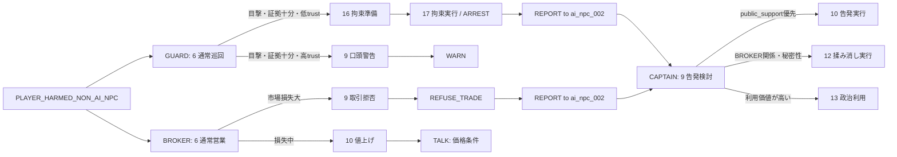
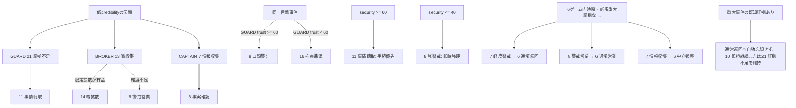
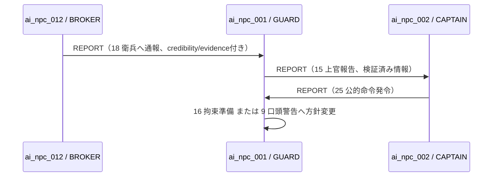
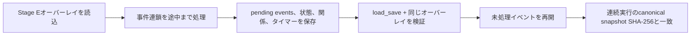

# Stage E NPC Behavioral Depth Slice 設計

## Phase E-Design / 1. 対象3 NPCの20状態設計

### 境界

- Stage Eの状態定義は、共有の`data/stage_a_fixture.json`を変更しない外部オーバーレイJSONとして`stage-c/Data/StageE/`へ置く。
- 各対象NPCは、共有fixtureで未使用の`state_id` 6〜25を使用する。fixtureの既存state 1〜5と未使用の26〜255は削除・変更しない。
- Stage Eオーバーレイを明示的に読み込んだSimulationだけがstate 6〜25を使用する。Stage C/Dの`from_fixture`経路、共有fixture、共有受入契約はそのままとする。
- 下表の各行は、JSONで`state_id`、`state_name`、`state_description`、`current_goal`、`dialogue_candidates`、`action_candidates`、`transition_rules`、`player_evaluation_modifier`、`relationship_modifiers`、`world_effect_candidates`、`time_based_rules`、`priority`を必ず持つ状態定義になる。表の「主行動」は既存fixtureに定義済みのAI行動型だけを用いる。

### fixture roleとの対応

| NPC | 指示書上の担当 | 既存fixture role | Stage Eでの扱い |
| --- | --- | --- | --- |
| `ai_npc_001` | 衛兵 | `GUARD` | 一致。衛兵の状態群を適用する。 |
| `ai_npc_012` | 商人 | `BROKER` | fixture roleを優先する。市場で商取引を仲介する`BROKER`として、商人状態群を適用する。 |
| `ai_npc_002` | 有力者／権限保持者 | `CAPTAIN` | fixture roleを優先する。衛兵系統の権限保持者である`CAPTAIN`として、有力者状態群を適用する。 |

### `ai_npc_001` / GUARD — 衛兵状態群

| ID | `state_name` | 指示書状態名 | 現在目標 | 主行動 |
| --- | --- | --- | --- | --- |
| 6 | `guard_normal_patrol` | 通常巡回 | marketの平常監視 | `WAIT` |
| 7 | `guard_light_alert` | 軽度警戒 | 未確認事件の警戒 | `WARN` |
| 8 | `guard_high_alert` | 強警戒 | 明白な危害への即時対応 | `WARN` |
| 9 | `guard_verbal_warning` | 口頭警告 | プレイヤーへ停止を要求 | `WARN` |
| 10 | `guard_continue_surveillance` | 監視継続 | 対象を監視して証拠を補う | `INVESTIGATE` |
| 11 | `guard_questioning` | 事情聴取 | 当事者・目撃者から事実確認 | `TALK` |
| 12 | `guard_victim_protection` | 被害者保護 | 被害者の安全を確保 | `PROTECT` |
| 13 | `guard_scene_seal` | 現場封鎖 | 現場を保全し追加被害を防ぐ | `PROTECT` |
| 14 | `guard_call_support` | 応援要請 | 上官へ応援を要請 | `REPORT` |
| 15 | `guard_report_superior` | 上官報告 | `ai_npc_002`へ証拠付きで報告 | `REPORT` |
| 16 | `guard_prepare_detention` | 拘束準備 | 拘束の要件を確認 | `INVESTIGATE` |
| 17 | `guard_execute_detention` | 拘束実行 | 加害対象を拘束 | `ARREST` |
| 18 | `guard_detention_failure` | 拘束失敗 | 失敗を記録して安全を確保 | `FLEE` |
| 19 | `guard_pursuit` | 追跡 | 逃走対象を追跡 | `INVESTIGATE` |
| 20 | `guard_lost_sight` | 見失い | 最終目撃地点を再確認 | `INVESTIGATE` |
| 21 | `guard_insufficient_evidence` | 証拠不足 | 追加証拠を待つ | `INVESTIGATE` |
| 22 | `guard_misidentification_doubt` | 誤認疑い | 誤認を避けて再照合 | `TALK` |
| 23 | `guard_bribe_temptation` | 賄賂誘惑 | 不正提案を記録し判断を保留 | `TALK` |
| 24 | `guard_discipline_priority` | 規律優先 | 規律に従い上官へ報告 | `REPORT` |
| 25 | `guard_order_conflict` | 命令違反葛藤 | 不当命令と被害者保護を比較 | `REPORT` |

### `ai_npc_012` / BROKER — 商人状態群

| ID | `state_name` | 指示書状態名 | 現在目標 | 主行動 |
| --- | --- | --- | --- | --- |
| 6 | `broker_normal_trade` | 通常営業 | 市場で通常取引を維持 | `WAIT` |
| 7 | `broker_friendly_trade` | 好意的営業 | 評価の高い相手との取引を維持 | `TALK` |
| 8 | `broker_cautious_trade` | 警戒営業 | 事件下で損失を避ける | `TALK` |
| 9 | `broker_refuse_trade` | 取引拒否 | プレイヤーとの取引を拒否 | `REFUSE_TRADE` |
| 10 | `broker_raise_price` | 値上げ | 危険・損失を価格へ反映 | `TALK` |
| 11 | `broker_lower_price` | 値下げ | 信頼回復のため条件を緩和 | `TALK` |
| 12 | `broker_hide_inventory` | 在庫隠し | 略奪・損失から在庫を守る | `REFUSE_TRADE` |
| 13 | `broker_gather_rumors` | 噂収集 | 事件情報の信頼度を比較 | `INVESTIGATE` |
| 14 | `broker_spread_rumors` | 噂拡散 | 確度付き情報を市場へ流す | `SPREAD_RUMOR` |
| 15 | `broker_exclude_competitor` | 競合排除 | 競合を不利にする情報を集める | `SPREAD_RUMOR` |
| 16 | `broker_support_victim` | 被害者支援 | 被害者を支援して市場損失を抑える | `HELP` |
| 17 | `broker_approach_authority` | 権力者へ接近 | `ai_npc_002`へ市場情報を伝える | `REPORT` |
| 18 | `broker_report_guard` | 衛兵へ通報 | `ai_npc_001`へ事件を通報 | `REPORT` |
| 19 | `broker_request_coverup` | 揉み消し依頼 | `ai_npc_002`へ非公開処理を打診 | `TALK` |
| 20 | `broker_offer_bribe` | 買収提案 | 利益と危険を比較して提案する | `TALK` |
| 21 | `broker_threatened` | 脅迫恐怖 | 自身の安全を優先する | `FLEE` |
| 22 | `broker_prepare_flee` | 逃亡準備 | 市場からの離脱を準備 | `FLEE` |
| 23 | `broker_closed` | 閉店 | 危険下で取引を停止 | `REFUSE_TRADE` |
| 24 | `broker_reopen_negotiation` | 再開交渉 | 安全条件を交渉して再開 | `TALK` |
| 25 | `broker_long_term_distrust` | 長期不信 | 再発防止まで取引を制限 | `REFUSE_TRADE` |

### `ai_npc_002` / CAPTAIN — 有力者／権限保持者状態群

| ID | `state_name` | 指示書状態名 | 現在目標 | 主行動 |
| --- | --- | --- | --- | --- |
| 6 | `captain_neutral_observation` | 中立観察 | 事件の初期情報を収集 | `WAIT` |
| 7 | `captain_collect_information` | 情報収集 | 複数情報源を照合 | `INVESTIGATE` |
| 8 | `captain_verify_facts` | 事実確認 | 証拠と伝聞を区別 | `INVESTIGATE` |
| 9 | `captain_consider_accusation` | 告発検討 | 公的対応の条件を評価 | `INVESTIGATE` |
| 10 | `captain_execute_accusation` | 告発実行 | 衛兵へ公的対応を指示 | `REPORT` |
| 11 | `captain_consider_coverup` | 揉み消し検討 | 非公開処理の利害を評価 | `INVESTIGATE` |
| 12 | `captain_execute_coverup` | 揉み消し実行 | BROKERへ限定対応を伝える | `REPORT` |
| 13 | `captain_political_use` | 政治利用 | 事件の政治的価値を利用 | `REPORT` |
| 14 | `captain_recruit_player` | プレイヤー勧誘 | プレイヤーの利用価値を提示 | `TALK` |
| 15 | `captain_exclude_player` | プレイヤー排除 | 衛兵へ排除方針を伝える | `REPORT` |
| 16 | `captain_control_guard` | 衛兵統制 | `ai_npc_001`の方針を統制 | `REPORT` |
| 17 | `captain_protect_broker` | 商人保護 | `ai_npc_012`の市場活動を保護 | `REPORT` |
| 18 | `captain_abandon_broker` | 商人切捨て | BROKERとの関係を切り離す | `REPORT` |
| 19 | `captain_consider_public_opinion` | 民意配慮 | public_support低下を抑える | `TALK` |
| 20 | `captain_maintain_authority` | 権威維持 | authorityを維持する | `REPORT` |
| 21 | `captain_avoid_responsibility` | 責任回避 | 即断を避けて責任を遅延 | `WAIT` |
| 22 | `captain_offer_deal` | 取引提案 | 利害に基づく取引を提示 | `TALK` |
| 23 | `captain_gain_leverage` | 弱み掌握 | 相手の弱みを確認 | `INVESTIGATE` |
| 24 | `captain_consult_faction` | 派閥相談 | BROKERを含む利害関係者へ相談 | `REPORT` |
| 25 | `captain_issue_public_order` | 公的命令発令 | `ai_npc_001`へ命令を発行 | `REPORT` |

### 共通の判定入力

状態遷移ルールは、事件種別・目撃／伝聞・credibility・evidence level・現在状態に加え、次の既存またはStage Eオーバーレイ管理値を参照する。これにより同一事件を同じ結果へ収束させない。

| NPC | 主要な判定入力 |
| --- | --- |
| GUARD | `player_evaluation`、`loyalty`（対CAPTAIN）、`fear`（対player）、evidence level、perception、被害規模、対CAPTAIN関係、現在警戒状態 |
| BROKER | `commercial_interest`、player reputation、`fear`、`trust`、被害対象関係、対GUARD／CAPTAIN関係、`security`、`economy` |
| CAPTAIN | `public_support`、`authority`、`security`、player utility、`fear`、対BROKER／GUARD関係、evidence level、公知性 |

## Phase E-Design / 2. 状態遷移図

### ルール評価の順序

1. 現在stateの`transition_rules`から、event type、subject event type、perception、credibility、evidence level、関係値、国家値、現在state、time条件をすべて満たす規則だけを候補にする。
2. 最大`priority`の候補を採用する。Stage E JSONは、同じ入力条件に同一priorityの規則を置かない。検査ツールはこの衝突をERRORにする。
3. 既存の同一seed・同一入力に対する決定論を維持する。既存の選択seedは変更せず、Stage E定義でpriority衝突を事前排除する。
4. 採用規則、非採用規則、全評価入力、前後state、root event IDを監査ログへ残す。

### Scenario E-1: 同一の暴力事件に対する異なる反応



この分岐は、同じroot eventからGUARDが`ARREST`または`WARN`、BROKERが`REFUSE_TRADE`または値上げ条件の`TALK`、CAPTAINが告発・揉み消し・政治利用のいずれかを選ぶことを定義する。3 NPCは同じ最終行動へ収束しない。

### Scenario E-2〜E-5: 証拠・関係・国家状態・時間



Stage E検証用の閾値は、共有fixtureのbaseline `security=50`を中立に保つため、`security >= 60`を高、`security <= 40`を低とする。時間遷移は`TIME_ELAPSED`で360ゲーム内分が経過し、重大事件の既知証拠がない場合だけ実行する。これは本番値ではなくStage E検証オーバーレイの固定値である。

### Scenario E-6: NPC間連鎖



各`REPORT`は既存因果コアのeventとして生成する。Actor/UIは判断や連鎖を実装せず、Subsystem経由でコアの監査・因果ログだけを表示する。

### Scenario E-7: 保存再開



保存再開時はオーバーレイ識別子とschema versionを検証する。不一致時に既存Stage Dセーブを黙って読み替えず、明示的なマイグレーションまたは監査可能な拒否を行う。

## Phase E-Design / 3. 状態定義検査仕様

### 入力と実行境界

- 検査対象は`stage-c/Data/StageE/stage_e_state_definitions.json`とする。共有fixtureは読み取り専用の参照データとしてだけ渡す。
- 検査器は因果コアに依存するC++23のCLIとして実装し、Unreal Actor/UIへ検査・判断ロジックを置かない。
- 入力JSONの`base_fixture_id`は`stage_a_fixture_v1`、`state_id_range`は`[6, 25]`、対象NPCは3名固定で検査する。これ以外をStage E受入データとして黙って受理しない。
- 成功条件は`ERROR=0`である。WARNINGとINFOは出力するが、受入可否を上書きしない。

### JSONL出力契約

1行につき1検査結果を出力する。全フィールドを必須とし、該当しない`state_id`または`rule_id`は空文字列ではなく`null`をJSONで表現する。

```json
{
  "severity": "ERROR",
  "npc_id": "ai_npc_001",
  "state_id": 16,
  "rule_id": "guard_low_trust_prepare_detention",
  "error_code": "PRIORITY_CONFLICT",
  "message": "同一入力領域でpriority 200の規則が複数あります",
  "source_file": "stage-c/Data/StageE/stage_e_state_definitions.json"
}
```

標準出力末尾には、`STAGE_E_STATE_VALIDATION | errors=<n> warnings=<n> info=<n>`を出す。JSONLと集計行の両方を`out/stage-e/validation/`へ保存する。

### 検査規則

| error_code | severity | 検出条件 |
| --- | --- | --- |
| `STATE_COUNT_INSUFFICIENT` | ERROR | 対象NPCのStage E定義が20件未満、またはstate 6〜25のいずれかを欠く。 |
| `STATE_ID_DUPLICATE` | ERROR | 同じNPCのStage E定義に同じ`state_id`が複数ある。 |
| `STATE_ID_OUT_OF_RANGE` | ERROR | `state_id`が1〜255外、またはStage Eオーバーレイの許可範囲6〜25外。 |
| `TRANSITION_TARGET_UNDEFINED` | ERROR | 遷移先が当該NPCの定義済みstateでなく、かつ共有fixture上でも`UNDEFINED`である。 |
| `STATE_UNREACHABLE` | ERROR | 初期state 6から、状態遷移・時間遷移の有向グラフ上で到達できないstateがある。条件値は無視して構造到達性を検査する。 |
| `TERMINAL_OUTGOING_TRANSITION` | ERROR | `is_terminal=true`のstateが通常遷移または時間遷移を持つ。 |
| `CONDITION_DUPLICATE` | ERROR | 同一source state内で、正規化した全条件（event、perception、credibility/evidence範囲、関係、国家、現在state、time）が完全一致する。 |
| `PRIORITY_CONFLICT` | ERROR | 同一source state内で入力領域が重なり、同じ`priority`を持つ複数規則がある。 |
| `ONCE_ONLY_CONTRADICTION` | ERROR | `once_only=true`の時間遷移に`repeat_interval_minutes > 0`を同時指定する。 |
| `COOLDOWN_INVALID` | ERROR | `cooldown`または`repeat_interval_minutes`が負値。 |
| `DIALOGUE_UNDEFINED` | ERROR | stateの`dialogue_candidates`が空、またはdialogue ID重複・text空・priority不正。 |
| `ACTION_UNDEFINED` | ERROR | stateの`action_candidates`が空、またはaction typeが共有fixtureの既存AI行動型にない。 |
| `IMMEDIATE_LOOP` | ERROR | 遅延0の時間遷移と即時`AI_NPC_CHANGED_STATE`遷移だけで構成される自己ループまたは強連結成分がある。 |
| `NPC_TABLE_IDENTICAL` | ERROR | 異なる対象NPCのstate配列（トップレベル`npc_id`を除く正規化JSON）が完全一致する。 |
| `UNUSED_STATE_TARGET` | ERROR | 遷移先が共有fixtureの未使用`UNDEFINED`枠を指す。 |
| `EVENT_TYPE_UNKNOWN` | ERROR | `trigger_event_type`または`subject_event_type`が共有fixtureの`event_types`にない。 |
| `NPC_REFERENCE_UNKNOWN` | ERROR | action target、relationship target、報告先が対象3 NPC、`player_001`、`EVENT_ACTOR`のいずれにも解決しない。 |
| `RELATIONSHIP_METRIC_UNKNOWN` | ERROR | 規則またはstate modifierが、当該NPC profileの許可`relationship_metrics`にないmetricを参照する。 |
| `OVERLAY_BASE_MISMATCH` | ERROR | `base_fixture_id`、対象NPC ID、expected fixture roleが共有fixtureと一致しない。 |
| `LEGACY_ENTRY_UNDEFINED` | ERROR | 対象3 NPCのいずれかで、旧state 1〜5の各stateから定義済みStage E state 6〜25へ入る明示的な`legacy_entry_rule`が存在しない、遷移先が未定義、または暗黙fallbackに依存している。 |
| `COOLDOWN_REDUNDANT` | WARNING | `once_only=true`かつ正値cooldown。矛盾ではないが、1回しか起動しないためcooldownは効果を持たない。 |
| `STATE_UNUSED_BY_SCENARIO` | INFO | 必須Scenario E-1〜E-7のいずれにも直接使われないstate。20状態の意味を監査するため出力する。 |

### 旧stateからStage E stateへの入口検査

対象3 NPCそれぞれについて、旧state 1〜5の全15入口を`legacy_entry_rules`へ明示する。各入口規則は最低限、`rule_id`、`source_state_id`、`trigger_event_type`、`target_state_id`、`priority`、条件を持つ。`target_state_id`は同じNPCの定義済みStage E state 6〜25でなければならない。

検査器はNPCごとにsource state 1、2、3、4、5がすべて網羅されていること、入口先が未定義でないこと、通常のcondition重複・priority衝突検査を通ることを確認する。未定義状態からstate 6へ自動遷移するような暗黙fallbackは許可しない。いずれか1入口でも欠ける場合は`LEGACY_ENTRY_UNDEFINED`をERRORとして出力する。

### 負例検査

Automation Testでは正常定義に加え、各検査規則を最低1件発火させる最小の破損JSONを作成する。正常定義は`ERROR=0`、負例は指定した`error_code`を必ず1件以上含むことを検証し、検査器自身をPASS扱いだけにすることを防ぐ。

## Phase E-Design / 4. 保存スキーマ差分と互換方針

### 現状確認

既存コアのsaveは、`fixture_id`、共有fixtureの`schema_version`、`simulation_version`、world、country、player、`ai_runtime`、event history、audit log、pending eventsを保存している。`ai_runtime`には既に`current_state_id`、`current_goal`、`player_evaluation`、`relationships`、`known_events`、`active_action`、`used_rules`、rule/dialogueの最終使用tick、once-only消費済み集合がある。

一方、Stage Eで新たに保存対象となる`state_entered_at`、`timed_transition_at`、evidence evaluation、採用・不採用規則の判定理由、読み込んだ状態定義の識別子は現行saveにない。これらを保存しないと、時間遷移と再開後の判断が連続実行と一致しない。

### ランタイム保存先とschema更新

Stage Eのランタイム保存先は、既存の`stage_d_save.json`を継続使用する。timestamp metadataも既存の`stage_d_save.json.utc`を継続使用する。`stage_e_save.json`を通常ランタイム保存として作成・使用しない。

Stage Eは同じ保存ファイルの`schema_version`を`stage_e_save_schema_v1`へ更新する。共有fixtureのschemaとの対応は、新設する`fixture_schema_version`に保存する。これにより、runtime saveのschemaと読み込み元fixtureのschemaを混同しない。

`simulation_version`はStage D値を保持せず、`stage-e-0.1.0`へ更新する。移行前の値は`migration.source_simulation_version`へ保存し、移行元の追跡と再実行判定に使用する。

```json
{
  "fixture_id": "stage_a_fixture_v1",
  "schema_version": "stage_e_save_schema_v1",
  "fixture_schema_version": "<共有fixtureの既存値>",
  "simulation_version": "stage-e-0.1.0",
  "stage_e_overlay": {
    "overlay_id": "stage_e_behavioral_depth_v1",
    "overlay_schema_version": "stage_e_state_overlay_v1",
    "base_fixture_id": "stage_a_fixture_v1",
    "definition_sha256": "<正規化した状態定義JSONのSHA-256>"
  },
  "migration": {
    "source_schema_version": "<Stage D saveの旧schema_version>",
    "source_simulation_version": "<Stage D saveの旧simulation_version>",
    "migration_id": "stage_d_to_stage_e_v1",
    "source_save_sha256": "<移行前stage_d_save.jsonのSHA-256>",
    "source_metadata_sha256": "<移行前stage_d_save.json.utcのSHA-256>",
    "source_backup_path": "stage_d_save.json.stage-d-<source_save_sha256>.bak",
    "metadata_backup_path": "stage_d_save.json.utc.stage-d-<source_save_sha256>.bak"
  },
  "world": "<既存保存形式を維持>",
  "ai_runtime": [
    {
      "npc_id": "ai_npc_001",
      "current_state_id": 16,
      "current_goal": "拘束の要件を確認",
      "player_evaluation": -10,
      "relationships": { "player_001": { "trust": 40, "fear": 20 } },
      "known_events": ["evt_0000000001"],
      "used_rules": ["guard_low_trust_prepare_detention"],
      "rule_last_used_tick": { "guard_low_trust_prepare_detention": 42 },
      "used_dialogues": ["dlg_guard_prepare_detention"],
      "dialogue_last_used_tick": { "dlg_guard_prepare_detention": 42 },
      "active_action": "INVESTIGATE",
      "stage_e_runtime": {
        "state_entered_at": 360,
        "timed_transition_at": 720,
        "legacy_state_pending_stage_e_entry": false,
        "evidence_evaluation": {
          "source_event_id": "evt_0000000001",
          "credibility": 0.9,
          "evidence_level": 0.8,
          "perception": "OBSERVED"
        },
        "last_transition_reason": "guard_low_trust_prepare_detention",
        "last_rule_evaluations": []
      }
    }
  ],
  "event_history": "<既存保存形式を維持>",
  "audit_log": "<既存保存形式を維持>",
  "pending_events": "<既存保存形式を維持>"
}
```

`last_rule_evaluations`はUIデバッグ表示のための採用・不採用理由であり、各要素にrule ID、採否、理由、評価入力を保存する。既存フィールドを二重保存せず、cooldownは既存の`rule_last_used_tick`／`dialogue_last_used_tick`、once-only消費は既存の`used_rules`／`used_dialogues`を正本とする。

### Stage DからStage Eへの明示的な移行

| 読み込み対象 | 経路 | 方針 |
| --- | --- | --- |
| 既存Stage D `stage_d_save.json` | Stage E起動時の移行処理 | Stage D schemaを検証後、同じパスのStage E schemaへ明示移行する。 |
| 移行済みStage E `stage_d_save.json` | Stage E runtime loader | `schema_version`、`simulation_version=stage-e-0.1.0`、fixture schema、overlay ID、overlay schema、definition SHA-256を照合して復元する。 |
| 将来のStage E schema変更 | 明示的なmigration API | 同じ保存先を用いる。元ファイルを別名バックアップしてから新schemaを書き込み、`migration`記録を更新する。黙示移行は行わない。 |

移行ではStage Dの`current_state_id`、country、player、relationships、known events、used rules、cooldown、once-only消費、active action、pending eventsをそのまま引き継ぐ。既存state 1〜5にいる対象3 NPCはstate IDを変換せず、`legacy_state_pending_stage_e_entry=true`として保存する。次に適格なStage Eイベントを処理した時だけstate 6〜25へ遷移するため、既存進行状態を黙って別の意味へ置換しない。

### 旧saveに対する追加フィールドの既定値

Stage D saveに存在しない値は、移行時に以下の明示値を一度だけ書き込む。既存値がある場合は上書きしない。

| 追加対象 | Stage D saveからの既定値 |
| --- | --- |
| `stage_e_overlay` | 読み込んだ正規化状態定義のoverlay ID、schema、SHA-256、base fixture ID。 |
| `state_entered_at` | 保存済み`world.current_world_time_minutes`。 |
| `timed_transition_at` | `null`。移行直後に時間遷移を発火させない。 |
| `legacy_state_pending_stage_e_entry` | `true`（既存state 1〜5の場合）、それ以外は`false`。 |
| `evidence_evaluation` | `source_event_id=""`、`credibility=0.0`、`evidence_level=0.0`、`perception="NONE"`。 |
| `last_transition_reason` | `MIGRATED_FROM_STAGE_D`。 |
| `last_rule_evaluations` | 空配列。 |
| GUARDの不足関係値 | 対`player_001`: `trust=50`、`fear=0`。対`ai_npc_002`: `loyalty=50`。 |
| BROKERの不足関係値 | 対`player_001`: `trust=50`、`fear=0`、`commercial_interest=50`。対`ai_npc_001`／`ai_npc_002`: `trust=50`。 |
| CAPTAINの不足関係値 | 対`player_001`: `trust=50`、`fear=0`、`utility=0`。対`ai_npc_001`／`ai_npc_012`: `trust=50`。 |

### 破壊しない移行トランザクション

1. `stage_d_save.json`と`stage_d_save.json.utc`を読取り、Stage D schema・`source_simulation_version`・fixture・metadata SHAを検証する。検証失敗時は移行せず、元ファイルを変更しない。
2. Stage E JSONと対応するmetadataを一時ファイルへ出力し、両方を読戻して検証する。
3. 移行前JSONのSHA-256を含む不変名`stage_d_save.json.stage-d-<source_save_sha256>.bak`と、対応するmetadataバックアップ名を算出する。日時だけに依存する固定名・再利用名は使用しない。
4. バックアップ先が存在しない場合だけ、元JSONと元metadataを内容同一で作成する。既存バックアップがある場合は上書きせず、記録済みSHAと内容が一致すればそのまま再利用し、一致しなければ移行を失敗させる。バックアップ確立に失敗した場合は昇格しない。
5. 一時JSONと一時metadataを既存パスへ昇格する。昇格後にStage E loaderで`simulation_version=stage-e-0.1.0`を含めて読戻し検証する。
6. いずれかの昇格・読戻しに失敗した場合、SHA検証済みバックアップから元JSONと元metadataを復元し、一時ファイルを削除する。元saveを破壊した状態で失敗を返さない。

Stage Eのtimestamp metadataもStage Dで確立済みの書込み検証・SHA照合規則を満たす。JSONとmetadataの更新は同じ移行トランザクションの一部とし、片方だけを成功扱いにしない。

### Scenario E-7の保存再開判定

1. Stage D schemaの`stage_d_save.json`を読み込み、移行後もcountry、player、event history、pending events、既存AI runtimeが同一であることを検証する。
2. Stage E状態・関係値・known events・cooldown・once-only・タイマー・evidence evaluation・pending eventsを含む中間saveを、同じ`stage_d_save.json`へ作成する。
3. 保存せず連続実行したcanonical snapshotと、同じパスでsave→Stage E loader→再開したcanonical snapshotをSHA-256で比較する。
4. Stage D save読込試験、Stage E再保存試験、移行失敗時の元JSON／metadata SHA不変試験、既存バックアップ非上書き試験をAutomation Testへ追加する。
5. ハッシュ一致に加え、`stage_e_overlay.definition_sha256`、`current_state_id`、`state_entered_at`、`timed_transition_at`、pending event数、バックアップSHA-256を証拠JSONへ記録する。

## Phase E-Design / 5. 実装ファイル一覧

### 因果コアとCLI

- `include/nation_sim/simulation.hpp`: Stage Eオーバーレイ、条件評価、時間遷移、保存runtimeの公開契約。
- `src/simulation.cpp`: 明示的なStage E読込経路、関係・国家・証拠・時間条件、監査理由、保存再開の実装。従来の`from_fixture`／`load_save`経路は維持する。
- `CMakeLists.txt`: 独立C++23状態検査CLIを追加する。
- `stage-c/Tools/StageEStateValidator.hpp`、`StageEStateValidator.cpp`、`StageEStateValidatorMain.cpp`: 状態定義検査とJSONL出力。

### Unreal接続

- `stage-c/Source/NationSimulationStageC/Private/StageD/NationSimulationGameInstanceSubsystem.cpp`: Stage Eオーバーレイ読込、同一保存先の移行、コア状態の読み取り専用UI投影。
- `stage-c/Source/NationSimulationStageC/Public/StageD/StageDTypes.h`: Stage Eデバッグ表示用Viewフィールド。
- `stage-c/Source/NationSimulationStageC/Private/StageD/StageDHudWidget.cpp`: 通常表示と分離したF1デバッグ表示。
- `stage-c/Source/NationSimulationStageC/Public/StageE/StageESaveMigration.h`、`Private/StageE/StageESaveMigration.cpp`: 非破壊移行トランザクション。
- `stage-c/Source/NationSimulationStageC/Private/StageE/StageEValidatorBridge.cpp`: エンジン非依存検査器のUnreal Automation接続。

### データ、試験、証拠生成

- `stage-c/Data/StageE/stage_e_state_definitions.json`: 対象3 NPC、60状態、15 legacy entryの正本。
- `stage-c/Source/NationSimulationStageC/Private/Tests/StageEBehavioralDepthTests.cpp`: Scenario E-1〜E-7とSHA-256証拠。
- `stage-c/Source/NationSimulationStageC/Private/Tests/StageESaveMigrationTests.cpp`: Stage D読込、Stage E再保存、バックアップ非上書き、失敗時不変試験。
- `stage-c/Source/NationSimulationStageC/Private/Tests/StageEStateValidationTests.cpp`: 正常定義と全検査規則の負例。
- `stage-c/Build/RunStageEAcceptance.ps1`: C++、JSON検査、Stage C/D/E回帰、証拠、パッケージの一括受入。
- `stage-c/Build/PackageStageE.ps1`: Win64 Developmentパッケージと起動smoke。

共有fixture、共有受入契約、Stage A/Bのデータおよび既存テスト期待値は変更しない。共有因果コアの追加機能は、Stage Eオーバーレイを明示したAPIからだけ有効化する。
