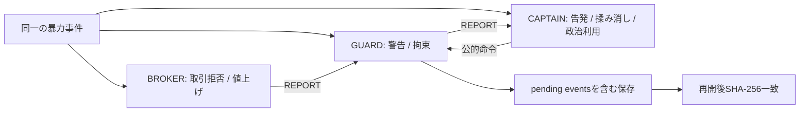

# Stage E NPC Behavioral Depth Slice 検証報告

検証日: 2026-07-11（JST）

## 1. 実施内容

Stage E設計を正本として、対象3 NPCの60状態、条件評価、時間遷移、関係・国家状態分岐、NPC間連鎖、保存移行、状態検査CLI、F1デバッグUI、Automation、Win64 Developmentパッケージを実装した。

Stage Eは明示的な外部オーバーレイを読み込んだSimulationだけに適用される。共有fixture、共有受入契約、既存テスト期待値は変更していない。

## 2. 変更ファイル

- 因果コア: `include/nation_sim/simulation.hpp`、`src/simulation.cpp`
- CMake/CLI: `CMakeLists.txt`、`stage-c/Tools/StageEStateValidator.*`
- 状態正本: `stage-c/Data/StageE/stage_e_state_definitions.json`
- 保存移行: `stage-c/Source/NationSimulationStageC/Public/StageE/StageESaveMigration.h`、`Private/StageE/StageESaveMigration.cpp`
- Unreal接続/UI: `NationSimulationGameInstanceSubsystem.*`、`StageDTypes.h`、`StageDHudWidget.cpp`、`DefaultEngine.ini`
- Automation: `StageEBehavioralDepthTests.cpp`、`StageESaveMigrationTests.cpp`、`StageEStateValidationTests.cpp`
- 再現スクリプト: `stage-c/Build/RunStageEAcceptance.ps1`、`PackageStageE.ps1`

詳細は`StageE_Design.md`の「実装ファイル一覧」を正本とする。

## 3. Stage D是正結果

- Stage D是正Automation: `8/8 tests passed`
- 時刻metadata整合、MOVE重複抑止、350uu相互作用境界を維持した。
- 証拠: `out/stage-d/fix-output/stage_d_fix_results.txt`

## 4. Stage D手動確認結果

- 既存Stage D手動チェック: `18/18 PASS`
- 記録: `stage-c/Docs/StageD_Manual_Verification_Checklist.md`

## 5. Stage Dコミット・タグ

- 実装基準コミット: `49ffdb638624dda3496b9382d66db779dcf31321`
- 注釈付きタグ: `stage-d-playable-v0.1.0`
- 検証報告コミット: `f95df9b8ffc7bf5bd1151ed6303fad9d9163ee5b`

## 6. Stage E実装内容

- 3 NPCごとに固有20状態、合計60状態と、旧state 1〜5からの明示入口15規則を実装。
- event、perception、credibility、evidence、関係値、国家値、player evaluation、状態滞在時間を条件評価へ追加。
- 採用規則と全不採用理由をコア監査状態へ保存。
- `stage_d_save.json`を継続使用し、`stage_e_save_schema_v1`、`simulation_version=stage-e-0.1.0`へ非破壊移行。
- 移行前JSON/metadataをSHA入り不変名でバックアップし、競合・失敗時に元ファイルを保持。
- F1デバッグ欄へ状態名、目標、遷移理由、関係、証拠、候補、採否理由、滞在時間、時間遷移予定を追加。
- Actor/UIへ判断ロジックは追加していない。

## 7. 対象3 NPCの状態一覧

- `ai_npc_001 / GUARD`: 6 `guard_normal_patrol`、7 `guard_light_alert`、8 `guard_high_alert`、9 `guard_verbal_warning`、10 `guard_continue_surveillance`、11 `guard_questioning`、12 `guard_victim_protection`、13 `guard_scene_seal`、14 `guard_call_support`、15 `guard_report_superior`、16 `guard_prepare_detention`、17 `guard_execute_detention`、18 `guard_detention_failure`、19 `guard_pursuit`、20 `guard_lost_sight`、21 `guard_insufficient_evidence`、22 `guard_misidentification_doubt`、23 `guard_bribe_temptation`、24 `guard_discipline_priority`、25 `guard_order_conflict`。
- `ai_npc_012 / BROKER`: 6 `broker_normal_trade`、7 `broker_friendly_trade`、8 `broker_cautious_trade`、9 `broker_refuse_trade`、10 `broker_raise_price`、11 `broker_lower_price`、12 `broker_hide_inventory`、13 `broker_gather_rumors`、14 `broker_spread_rumors`、15 `broker_exclude_competitor`、16 `broker_support_victim`、17 `broker_approach_authority`、18 `broker_report_guard`、19 `broker_request_coverup`、20 `broker_offer_bribe`、21 `broker_threatened`、22 `broker_prepare_flee`、23 `broker_closed`、24 `broker_reopen_negotiation`、25 `broker_long_term_distrust`。
- `ai_npc_002 / CAPTAIN`: 6 `captain_neutral_observation`、7 `captain_collect_information`、8 `captain_verify_facts`、9 `captain_consider_accusation`、10 `captain_execute_accusation`、11 `captain_consider_coverup`、12 `captain_execute_coverup`、13 `captain_political_use`、14 `captain_recruit_player`、15 `captain_exclude_player`、16 `captain_control_guard`、17 `captain_protect_broker`、18 `captain_abandon_broker`、19 `captain_consider_public_opinion`、20 `captain_maintain_authority`、21 `captain_avoid_responsibility`、22 `captain_offer_deal`、23 `captain_gain_leverage`、24 `captain_consult_faction`、25 `captain_issue_public_order`。

## 8. 状態遷移図

全遷移図と閾値は`StageE_Design.md`を参照。

## 9. 状態検査結果

- 正常定義: `errors=0 warnings=0 info=35`
- 35件のINFOは、Scenario E-1〜E-7から直接参照されない状態の監査情報であり、受入失敗ではない。
- JSONL必須フィールド7項目を全行で確認。
- 20種のERROR、`COOLDOWN_REDUNDANT` WARNING、通常INFOを実際に発火させる負例: `22/22 PASS`
- 定義SHA-256: `9913d473df3a1be8b71400150e2d76a7f6b46a66dadc0f218027346f0978b833`
- 証拠: `out/stage-e/validation/`、`out/stage-e/validation-negative/`

## 10. Automation Test結果

- Scenario E-1〜E-7と状態/legacy入口: `8/8 PASS`
- Stage D→E保存移行: `4/4 PASS`
- 状態検査正常/負例: `22/22 PASS`
- Unreal `NationSimulation.Stage`配下: 7テストすべてSuccess。

Scenario E-7は、pending eventが2件残る中間saveから再開し、連続実行と再開実行が同一SHA-256になった。

`82dbd8c6d572bc3b5140379c663580ac05778090f3d3ba4fe22e84b00d916184`

## 11. 回帰試験結果

- C++因果コア: `10/10 PASS`
- Stage C Automation: `11/11 PASS`
- Stage D Automation: `9/9 PASS`
- Stage D是正: `8/8 PASS`
- 共有fixtureと既存受入結果は維持。

## 12. パッケージ結果

- Win64 Development BuildCookRun: `BUILD SUCCESSFUL`
- マップ: `/Game/Maps/StageD_Capital`
- 40 NPC初期化: `PASS`
- `STAGE_E_CORE_READY`: `PASS`
- ヘッドレス起動smoke: `PASS`
- 実行ファイル: `out/stage-e/package/Windows/NationSimulationStageC.exe`
- 実行ファイルSHA-256: `7931c90fa1b8c11845d8a6782b02b03bef463de800ffbb7da258f37d1e2bcc64`

## 13. 既知の問題

- Windowsファイアウォール許可後、ユーザーが実機でStage Eパッケージを操作し、F1デバッグ表示を含めて動作問題なしと確認した。
- Stage E受入を妨げる既知の問題はない。

## 14. 未実装

- 本番コンテンツ、本番アセット、完成版戦闘、クエスト、職業/国王ルート、大規模政治/経済、LLMは指示どおり未実装。
- Stage Eのコミット、タグ、pushは今回指示されていないため未実施。

## 15. 次工程候補

1. Stage E基準コミット・注釈付きタグ・pushを別指示で実施する。

## 証拠一覧

- 一括受入: `out/stage-e/stage_e_acceptance_results.txt`
- Scenario E: `out/stage-e/test-output/stage_e_scenario_evidence.json`
- 中間save: `out/stage-e/test-output/stage_e_mid_chain_save.json`
- 監査ログ: `out/stage-e/test-output/stage_e_audit.jsonl`
- 因果ログ: `out/stage-e/test-output/stage_e_causal.jsonl`
- 保存移行: `out/stage-e/migration-output/stage_e_migration_evidence.json`
- 状態検査: `out/stage-e/validation/stage_e_validation.jsonl`
- 負例検査: `out/stage-e/validation-negative/stage_e_validator_negative_evidence.json`
- パッケージ: `out/stage-e/package_launch.txt`
- 起動ログ: `out/stage-e/package/Windows/NationSimulationStageC/Saved/Logs/NationSimulationStageC.log`
- 実機操作確認: `out/stage-e/stage_e_manual_verification.txt`
